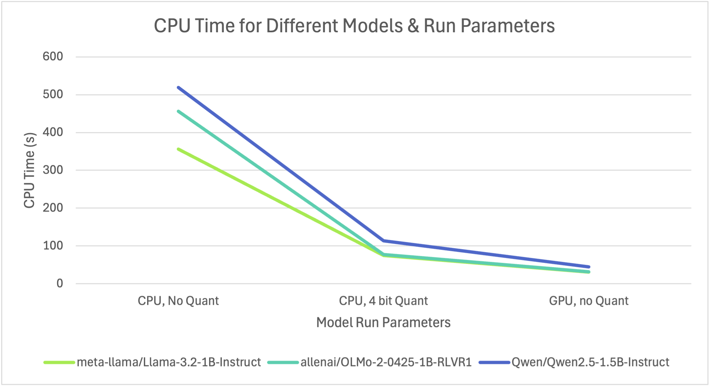
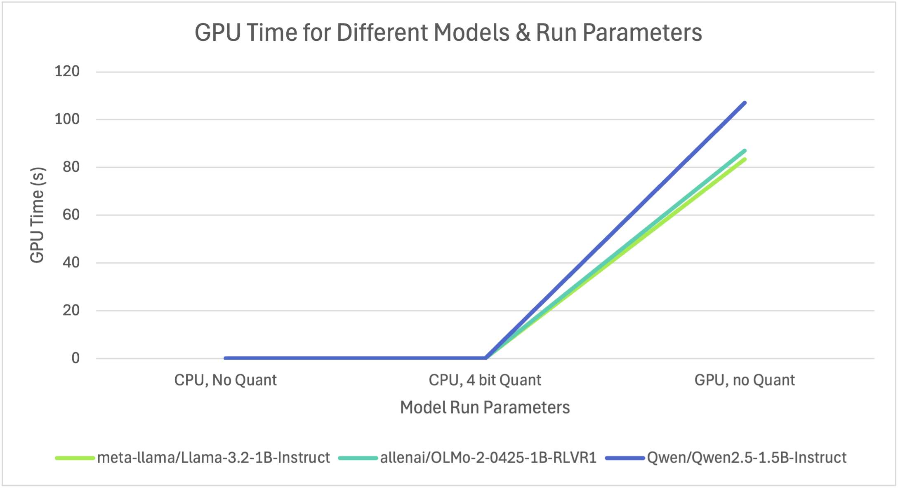
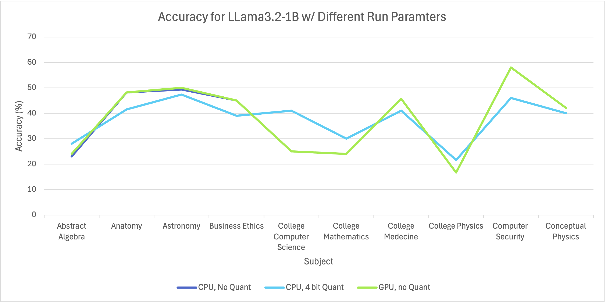
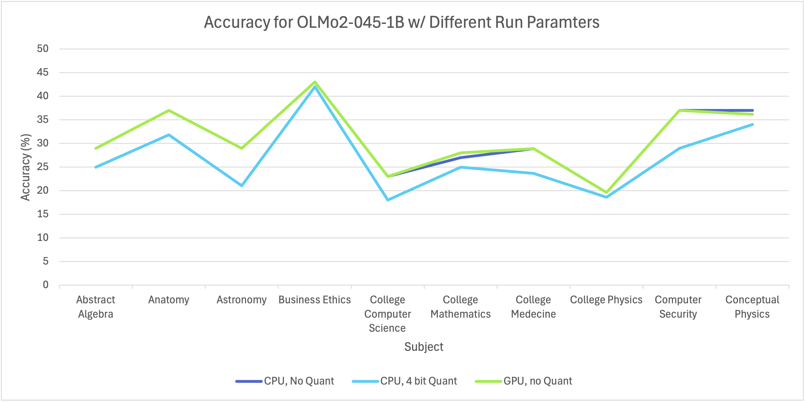
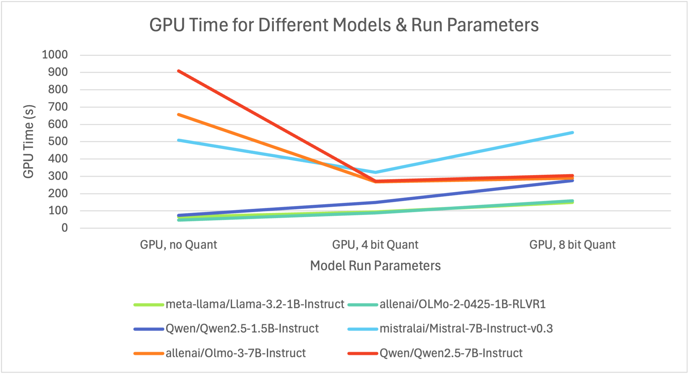
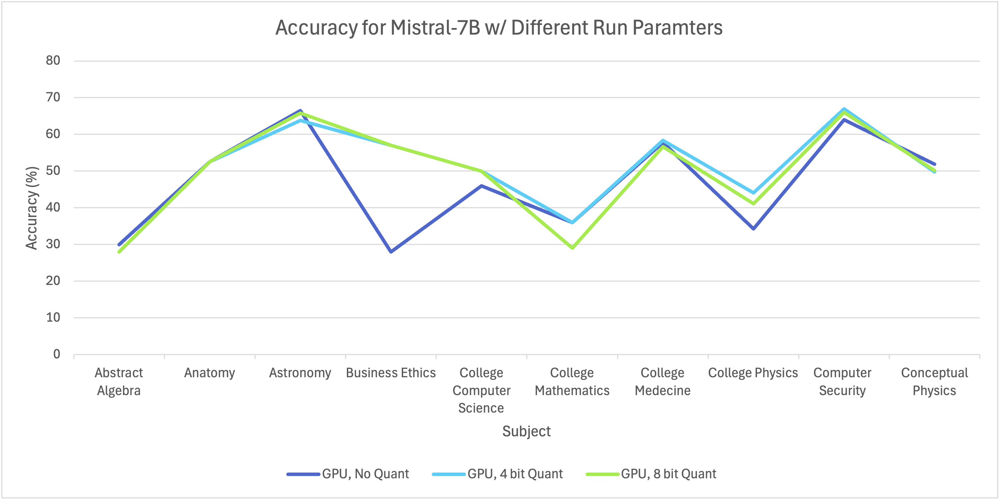
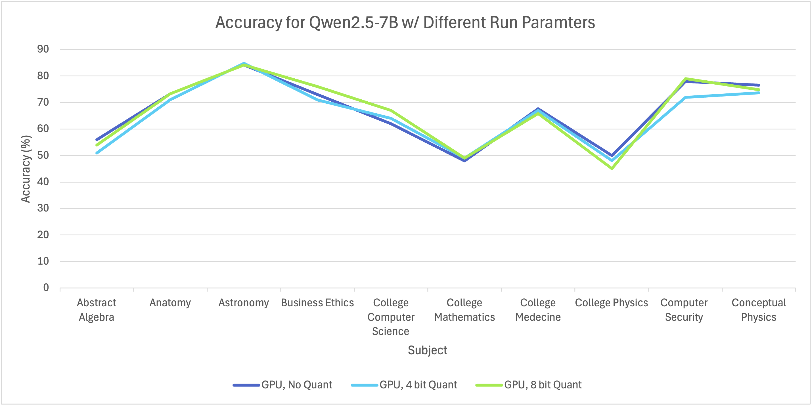

# Notes, Questions, & Graphs

## Runtimes for LLama 3.2B w/ 2 Subjects:

### Llama 3.2-1B Runtimes w/ 2 Subjects  (Local)
-----------------------------------

GPU - no Quantization      : 7.12s user 2.45s system 52% cpu 18.307 total
GPU - 4 bit Quantization   : -
GPU - 8 bit Quantization   : -

CPU - no Quantization      : 57.07s user 14.34s system 194% cpu 36.782 total
CPU - 4 bit Quantization   : 12.50s user 5.03s system 15% cpu 1:56.74 total

### Llama 3.2-1B Runtimes w/ 2 Subjects  (Colab)
-----------------------------------

GPU - no Quantization      : real	1m18.293s   user	0m34.911s   sys	0m9.470s
GPU - 4 bit Quantization   : real	0m45.814s   user	0m34.058s   sys	0m3.440s
GPU - 8 bit Quantization   : real	0m56.388s   user	0m45.400s   sys	0m3.188s

CPU - no Quantization      : real	11m1.537s   user	10m32.780s  sys	0m5.216s
CPU - 4 bit Quantization   : real	1m25.376s   user	0m39.463s   sys	0m5.321s

## Results of LLM Runtimes and Accuracy:

### Graphs of Results (Local)

### Answers to Questions:

Can you see any patterns to the mistakes each model makes or do they appear random?  Do the all the models make mistakes on the same questions? 

The mistakes that each models make seems to be random for each model, I could not see any pattern to the mistakes. All the models do not make mistakes on the same questions, the Llama model and the OLMo model did seem to make mistakes on a lot of similar questions compared to the qwen model but they all made mistakes on different questions too.

### Graphs of Results (Colab)

### Answers to Questions:

Can you see any patterns to the mistakes each model makes or do they appear random?  Do the all the models make mistakes on the same questions? 

Similar to when I ran the models locally, the mistakes that each models make seems to be random for each model, I could not see any pattern to the mistakes. All the models do not make mistakes on the same questions, but here was a lot of overlap on the questions that they were getting wrong but there were a lot of questions that only one or two modles would get wrong but others would get right.

## Answer to Question about Chat Agent History

Compare how the chat agent performs on a multi-turn conversation when the history is maintained and when it is not.

When the chat history is maintained, you can ask multiple questions turn by turn and the model still knows what you the subject is but when the history is turned off, the model has absolutely no idea and depending on how the prompt is you get confusion for prompts where the context would have been in the history and for prompts where there is a little context then it goes off on that tanget because that is the only context it has.