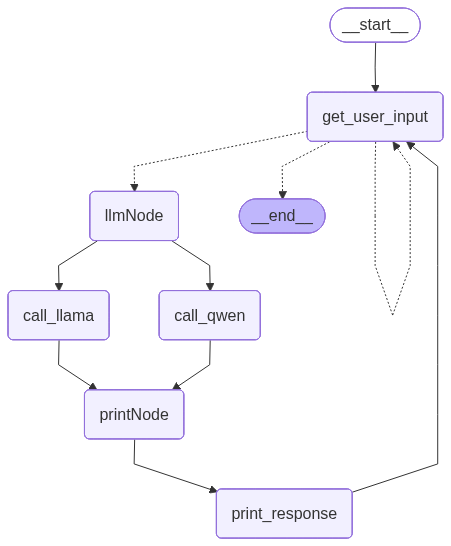

# Topic 2 Frameworks Table of Contents

---

## 0. Original

- [Original Langgraph Agent File](./langgraph_agent_0.py)

---

## 1. Verbose Outputs

- [Langgraph Agent File with Verbose option](./langgraph_agent_1_verbose.py)

- [Task 1 Example Output](./outputs/output1.txt)

---

## 2. Account for Empty Inputs

- [Langgraph Agent File that accounts for empty inputs](./langgraph_agent_2_empty.py)

- [Task 2 Example Output](./outputs/output2.txt)

---

## 3. Parallel Models

- [Langgraph Agent File that passes to both models](./langgraph_agent_3_llmNode.py)

- [Task 3 Example Output](./outputs/output3.txt)

---

## 4. Llama or Qwen

- [Langgraph Agent File that selects between Llama and Qwen](./langgraph_agent_4_LorQ.py)

- [Task 4 Example Output](./outputs/output4.txt)

---

## 5. Chat History

- [Langgraph Agent File with Chat History](./langgraph_agent_5_history.py)

- [Task 5 Example Output](./outputs/output5.txt)

---

## 6. Chat History w/ Llama or Qwen

- [Langgraph Agent File with Chat History that selects between Llama and Qwen](./langgraph_agent_6_switch.py)

- [Task 6 Example Output](./outputs/output6.txt)

---

## 7. Recovery & Checkpointing

- [Langgraph Agent File wiht Checkpointing and Recovery](./langgraph_agent_7_recovery.py)

- [Task 7 Example Output](./outputs/output7.txt)

---
